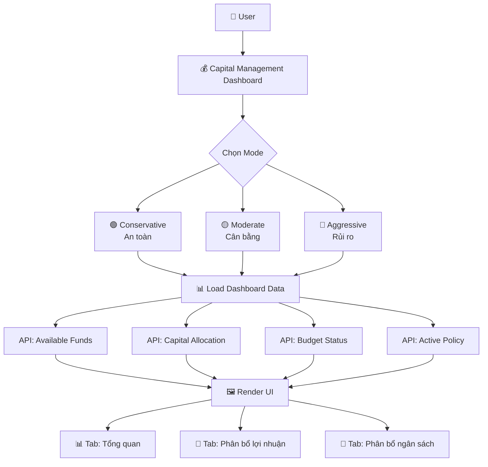
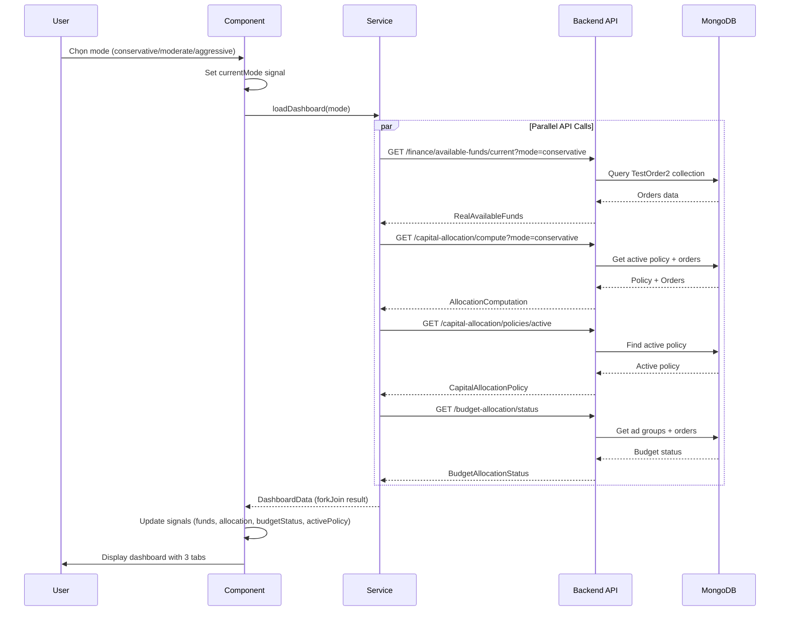
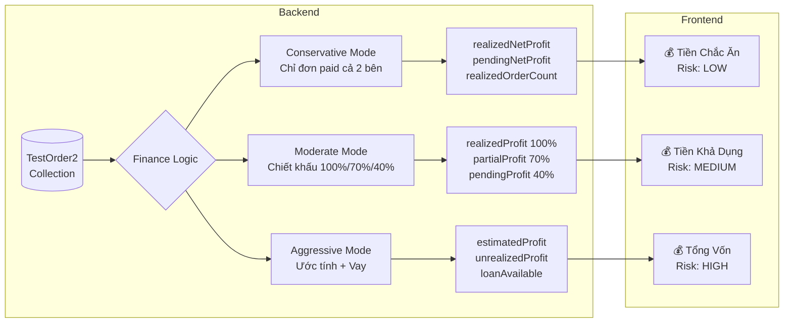
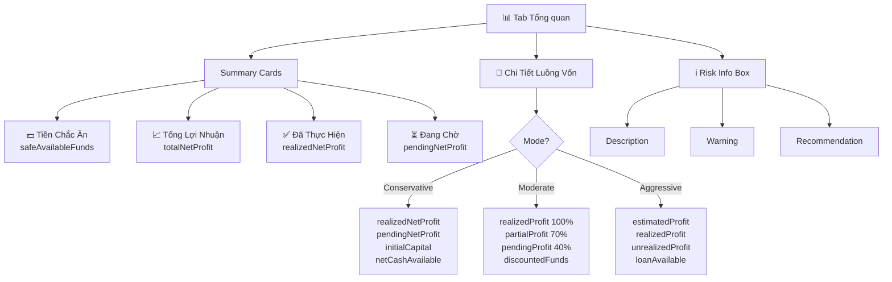
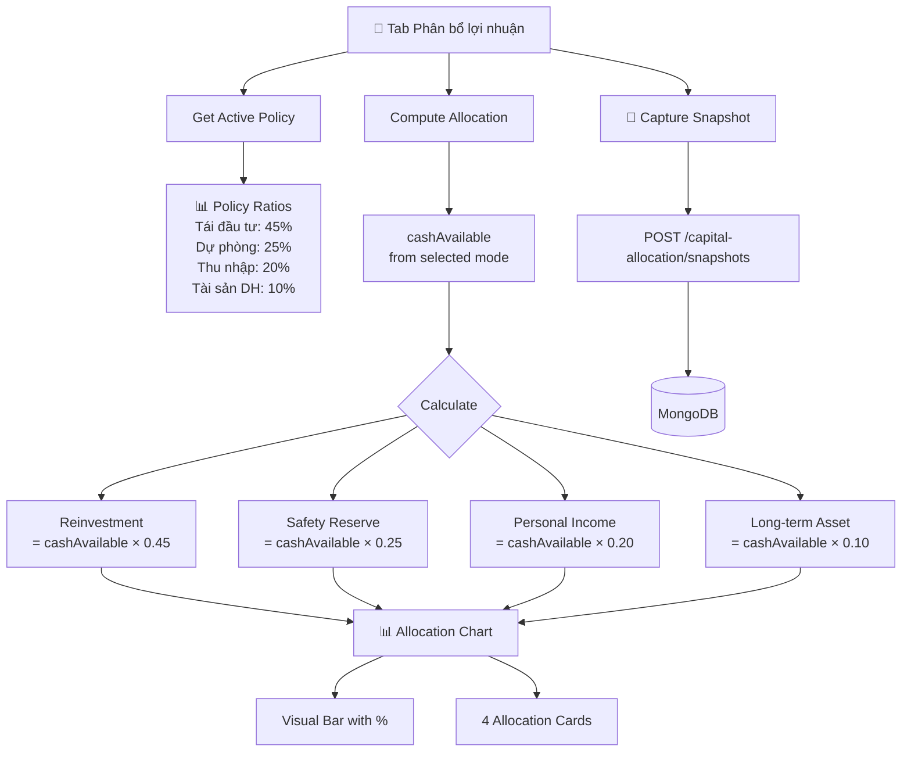
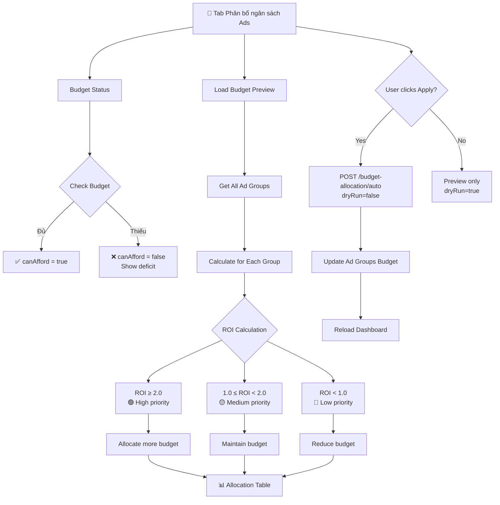
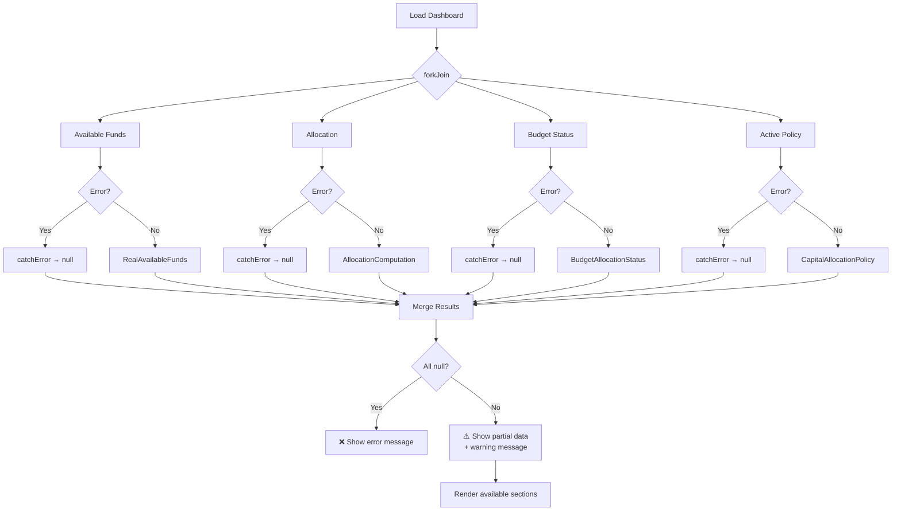
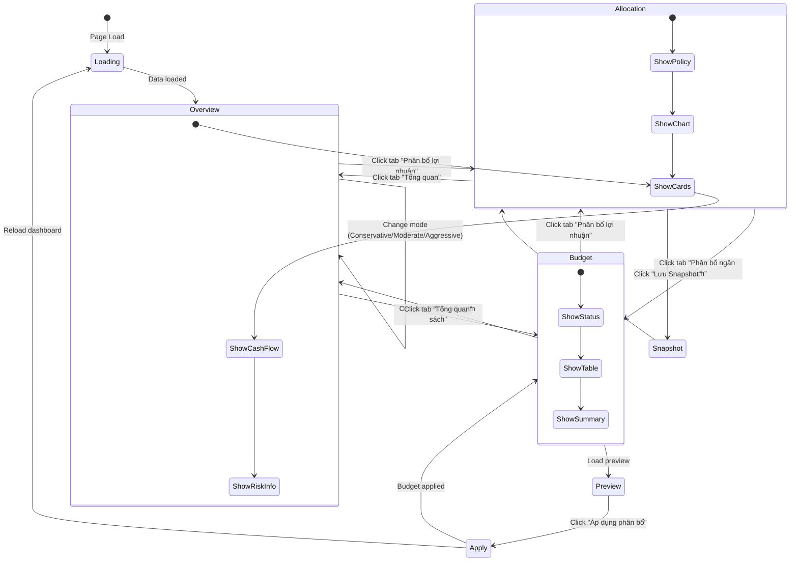
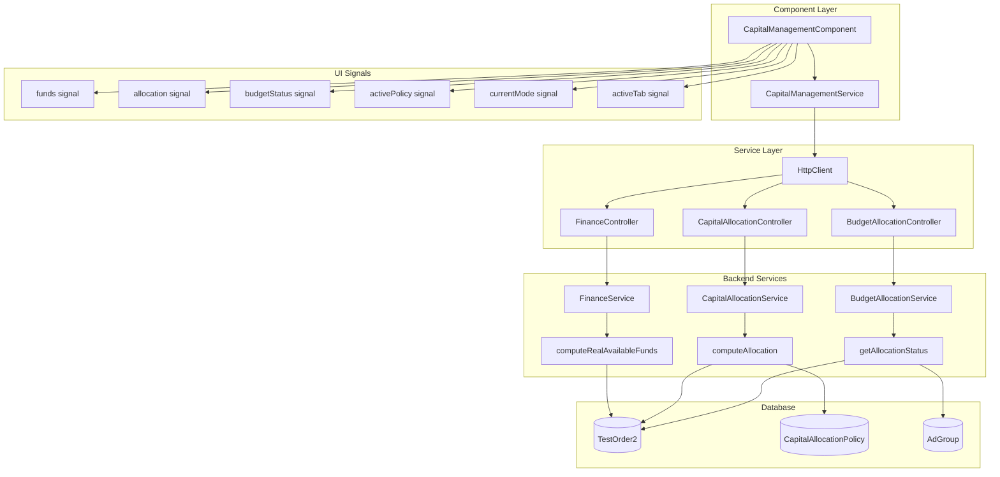

# 💰 Luồng Hoạt Động - Dashboard Quản Lý Vốn & Phân Bổ

## 1. Tổng Quan Kiến Trúc



## 2. Luồng API Call Chi Tiết



## 3. Luồng Dữ Liệu Theo Mode



## 4. Tab 1: Tổng Quan - Luồng Hiển Thị



## 5. Tab 2: Phân Bổ Lợi Nhuận - Luồng Xử Lý



## 6. Tab 3: Phân Bổ Ngân Sách Ads - Luồng ROI



## 7. Data Flow - Backend Logic

```mermaid
flowchart LR
    subgraph TestOrder2 Schema
        O1[supplierPaymentStatus]
        O2[agentPaymentStatus]
        O3[supplierPaidAmount]
        O4[agentPaidAmount]
        O5[realizedGrossProfit]
        O6[realizedNetProfit]
        O7[realizedAt]
    end
    
    subgraph Finance Service Logic
        O1 --> Check1{Both paid?}
        O2 --> Check1
        
        Check1 -->|Yes| Realized[✅ Realized<br/>supplierPaymentStatus='paid'<br/>agentPaymentStatus='paid'|'n/a']
        Check1 -->|No| Pending[⏳ Pending<br/>Chưa thanh toán đủ]
        
        Realized --> Calc1[realizedNetProfit<br/>= supplierPaidAmount - agentPaidAmount]
        Pending --> Calc2[pendingNetProfit<br/>= estimated based on orders]
    end
    
    subgraph Conservative Mode
        Calc1 --> Safe[💰 Safe Available Funds<br/>= Σ realizedNetProfit + initialCapital]
    end
    
    subgraph Moderate Mode
        Calc1 --> R100[Realized: 100%]
        Pending --> R70[Partial paid: 70%]
        Pending --> R40[Pending: 40%]
        R100 --> Discount[Discounted Funds]
        R70 --> Discount
        R40 --> Discount
    end
    
    subgraph Aggressive Mode
        Calc1 --> Est[Estimated Profit]
        Calc2 --> Est
        Est --> Loan[+ Loan Available]
        Loan --> Total[Total Funds<br/>⚠️ HIGH RISK]
    end
```

## 8. Error Handling Flow



## 9. User Interaction Flow



## 10. Component Architecture



## 11. Key Features Summary

### ✅ Đã Hoàn Thành

1. **Dashboard Tích Hợp**
   - Gộp 4 features cũ thành 1 dashboard duy nhất
   - 3 tabs: Tổng quan, Phân bổ lợi nhuận, Phân bổ ngân sách

2. **Mode Selector**
   - 3 modes: Conservative (An toàn), Moderate (Cân bằng), Aggressive (Rủi ro)
   - Thay đổi mode → Reload tất cả data

3. **API Integration**
   - Parallel loading với forkJoin
   - Error handling với catchError
   - Graceful degradation (nếu 1 API fail, các API khác vẫn hoạt động)

4. **Responsive UI**
   - Summary cards với icons và badges
   - Visual allocation chart
   - ROI-based budget table
   - Mobile-friendly design

5. **Real-time Data**
   - Dữ liệu từ TestOrder2 collection
   - Chỉ tính đơn đã thanh toán (realized profit)
   - Hiển thị pending orders

### 🎯 Route & Navigation

```
/finance/capital-management  (Dashboard chính - default route)
  ├─ Tab: Tổng quan
  ├─ Tab: Phân bổ lợi nhuận
  └─ Tab: Phân bổ ngân sách

/finance/available-funds     (Cũ - ẩn trong sidebar)
/finance/capital-allocation  (Cũ - ẩn trong sidebar)
/finance/capital-flow        (Cũ - ẩn trong sidebar)
/finance/budget-allocation   (Cũ - ẩn trong sidebar)
```

### 📊 API Endpoints

```
GET  /api/finance/available-funds/current?mode=conservative
GET  /api/capital-allocation/policies/active
GET  /api/capital-allocation/compute?mode=conservative
GET  /api/budget-allocation/status
POST /api/capital-allocation/snapshots
POST /api/budget-allocation/auto
```

### 🔄 Data Sync Flow

```
User Action → Component → Service → HTTP → Backend API → Database
                ↓                                            ↓
            Update Signals ← Transform Data ← Query Results
                ↓
            Render UI (Reactive with Angular Signals)
```
